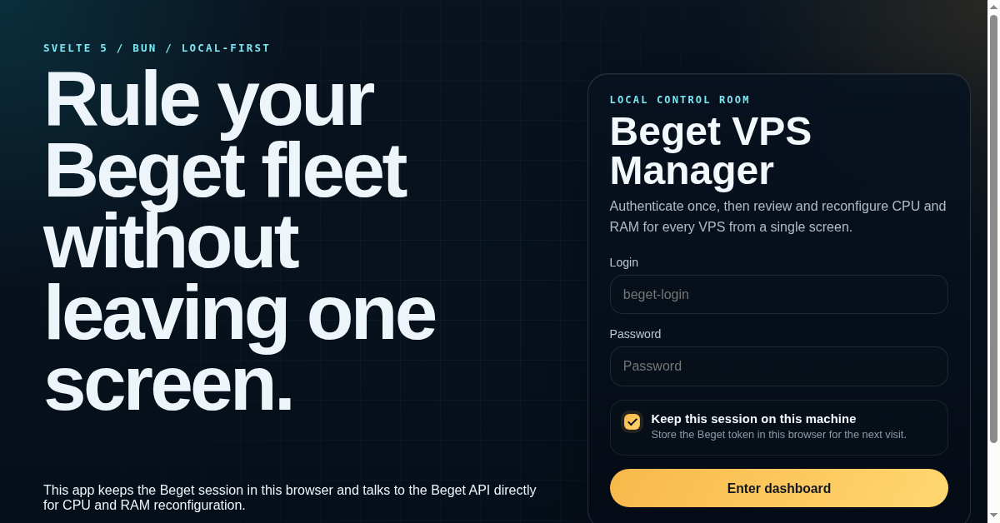

# Beget VPS Manager

Static Svelte 5 web app that authenticates directly with Beget and manages VPS CPU/RAM changes from a single screen.



## Live

https://beget-vps-manager.yagee.me/

## OpenAPI

- [Beget Auth API docs](https://developer.beget.com/#auth-/v1/auth)
- [Beget Cloud VPS API docs](https://developer.beget.com/#overview-/v1/vps)

Local OpenAPI snapshots for development can be kept in `openapi/`, but they are intentionally not committed to the repository.

## Stack

- Bun
- SvelteKit 2
- Svelte 5 runes
- Static output via `@sveltejs/adapter-static`
- Direct browser requests to the Beget API
- Local UI persistence for filters and dashboard state preferences
- Local Beget token storage in `localStorage` or `sessionStorage`

## Commands

| Script | Purpose |
| --- | --- |
| `bun run dev` | Start the local Vite dev server. |
| `bun run check` | Run `svelte-check` against the project TypeScript config. |
| `bun run check:watch` | Run `svelte-check` in watch mode. |
| `bun run format` | Apply Biome formatting and safe fixes. |
| `bun run build` | Build the static site into `build/`. |
| `bun run preview` | Preview the built site locally on `${PORT:-4173}`. |
| `bun run prebuild` | Lifecycle hook that runs `bun run format` before `build`. |
| `bun run prepare` | Lifecycle hook that syncs SvelteKit and sets the local Git hooks path. |

`bun run build` writes the static site to `build/`.

## Environment

Optional override:

```bash
PUBLIC_BEGET_API_BASE_URL=https://api.beget.com
```

## App shape

- Auth is stored only in this browser, not on the app server.
- The UI does not require a separate backend database.
- The dashboard calls the Beget API directly from the browser.
- The app is a browser client for Beget's live API, not an offline-first or synced local database app.
- The app fetches VPS data, available configuration groups, and configurator limits.
- Each VPS card supports live CPU/RAM recalculation and submitting a configuration change.
